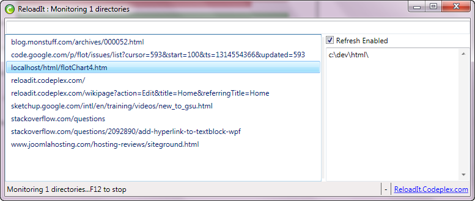

# ReloadIE
ReloadIE is like Live Reload, for Windows. It automatically reloads a page in IE, when a change is detected in a given file or directory.

Save your file (js css htm aspx etc) and ReloadIt tells IE to refresh the page. You see changes instantly while developing. It's like an *automatic F5* button for your browser. It's implemented in C# as a WPF project, but it works with any web project - PHP, jQuery, JSP, HTML and Javascript, ASPX, anything. You will be amazed at how much this simple tool makes your life better.

## A Simple tool for web developers

The other day I heard about "Live Reload" - a tool that apparently is available for Mac, and works with Chrome and Safari. It automatically reloads a webpage when a source file gets changed - a nice convenience for developers of web apps. There used to be a Firefox add-in called Xrefresh that did this; not sure of its current status. I do most of my work on Windows, and thought it would be nice to have that kind of tool on Windows. And that's how ReloadIt was born.

ReloadIt is a small tool that does one thing - reload web pages. It's easy and handy. Free to use, and licensed under the MS-PL.

If you're like me, your edit-test-debug cycle is pretty rapid. I tweak a js file , and I'd like to see the effect immediately. I change a .css style, and I want immediate feedback - did it do what I expected? I modify the HTML and change the server-side code, and I want to see what the webpage looks like. Each change affects the way the webpage looks. This tool updates the appropriate IE tab after every change, automatically. Like pressing F5 in the appropriate IE tab, only without changing windows.

ReloadIt works with any editor. Stay in your editor, save any file involved in the project, and ReloadIt automatically causes IE to reload the configured page. It saves a few seconds, but more importantly, several mental context switches. It can make a surprisingly big difference in your work. Keep the IE window open and partly visible, and never leave your editor. You don't need to swap back-and-forth between windows. It'll make your life better.

I published this tool in hopes that other people would like to use it too. If you try it and like it, let me know. If you try it and don't like it, let me know that too. Suggestions and questions to the discussions list. If I get reasonable enhacement requests I'll put them into the tool.

## Example Usage: The Tool
In the image above, you see the ReloadIt tool. On the left hand side, I've selected a URL that is already displayed in an IE tab. On the right hand side, I've specified a directory to watch for changes.

## Example Usage: An Editing Session.

What you're seeing above: an IE Window is open in the background, displaying a bar chart created using the flot Javascript library. This is the same URL that was selected in the previous screenshot. A text editor is open on the right hand side, editing a Javascript module that defines the data being displayed in the chart. I modify the file, and save the .js module. At that point ReloadIt (not pictured) detects the change, and tells IE to reload the changed page. This works with any editor, any type of source file, any server-side technology. Once you configure ReloadIt, you don't need to go back into the tool. Set it and forget it. Minimize it, and perform your edits as normal. It quietly reloads pages as necessary.

## FAQ

- *How do I use ReloadIt?*

  Open your page in IE. Then start ReloadIt. In the left-hand-side of the tool, select the URL you want to be automatically reloaded. In the right hand side of the tool, specify one or more "paths to watch" for changes. Each should be a path to a directory, a path to a file, or a path to a set of filenames specified via wildcards (eg, c:\dir1\*.htm). Tick the checkbox, and press F12. When any file changes in any of those directories (or any of their subdirectories), ReloadIt will tell IE to reload the selected page. It happens in less than a second.

- *Cool!*

  Yeah, I know.

- *Can ReloadIt watch for changes in a specific file?*

  Yes, as of v1.1.0.1. It can watch directories, specific files, or a set of files described by a wildcard. You can configure a set of those things for any webpage; when any change happens in any of them, ReloadIt reloads the webpage.

- *Can ReloadIt watch for changes in a remote website?*

  No. ReloadIt is not a consumer-oriented tool that monitors websites. It's a developer tool. It monitors FILES, and then refreshes an IE tab when the file changes.

- *Is it fast?*

  The IE tab begins reloading the page, within less than a second after you've saved your file. It's pretty quick, normally. For directories containing a large number of files, or a large number of subdirectories, the latency will be higher. If you configure a larger number of tabs to reload, that may also affect the latency.

- *Does it work with Firefox? Chrome? Safari? Linux? Mac?*

  No. It works with IE only. And obviously only on Windows.

- *Does it work with IE7?*

  I don't know. I tried it only on my machine, IE9 on Windows 7. It should work with IE8 and on prior versions of Windows.

- *Does it require IIS?*

  No. It doesn't matter what the server-side technology is, including the web server. In fact the only connection between the directory you select, and the URL that gets refreshed, is in ReloadIt's memory. You could, for example, tell reloadit to re-load a browser page showing the Google news feed, every time the file c:\temp\foo.txt changes. Not sure how useful that would be, but it's possible. The main use case, is to enable a rapid edit-test-debug cycle for developers who build websites on Windows.

- *I noticed that the IE page does not reload repeatedly when there are multiple changes in quick succession. But I want it to reload faster. Can I do that?*

  Yes, there's a registry setting for that. It's in \HKCU\Dino Chiesa\ReloadIt\ReloadIntervalInMs . It's a DWORD, set it to the minimum number of milliseconds between successive reloads. A value of 3200 would mean ReloadIt would not reload a web page until at least 3.2s elapsed since the prior reload, regardless of any ongoing changes detected in the filesystem. Lower the value to allow more frequent reloads.

- *How does ReloadIt work?*

  It's just a WPF form around a FileSystemWatcher, plus some IE-specific magic to get the list of currently-open IE tabs. Pretty simple.

- *My page is getting reloaded constantly. WTF?*

  The directory you are watching, is probably getting more changes that you imagined it would. You'll need to monitor a more specific directory, or specify an individual file, or reduce the number of changes being made to the file, or something along those lines.

- *Can ReloadIt open a page in IE?*

  No. ReloadIt can only reload a page that is already open in an IE tab. Open the page first in IE, then start ReloadIt.

- *How do I tell ReloadIt to stop monitoring for changes?*

  Press F12, and ReloadIt stops or starts monitoring.

- *How do I ask ReloadIt to re-scan the list of IE tabs?*

  Press F5 to refresh the list of URLs. For any tab open in IE, ReloadIt will list the URL in the left-hand-side listbox.

- *What else?*

  There's a right-click context-menu that allows you to close, refresh, or bring-to-front any tab in IE. This logic may be interesting for other apps.

- *Does ReloadIt remember the reload settings for various URLs?*

  Yes, it's got a Most-Recently-Used list of URLs and directories to watch. The list is 15 elements long, so if you stop ReloadIt, and then run it tomorrow, it will remember the settings you've used for various websites.

- *Can ReloadIt work with ASPNET MVC pages?*

  Sure, it works with any server-side technology. If you want to display generated JSON in IE, then you will need to futz with the registry, as per [this tip on stackoverflow](http://stackoverflow.com/questions/2483771/).
